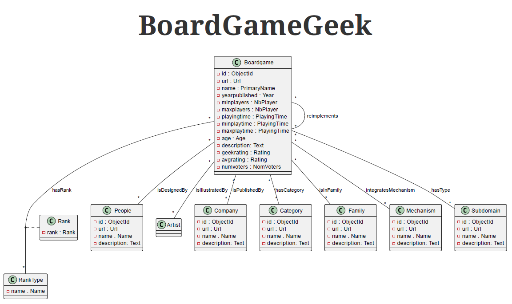

# spark_boardgames_project

## Installation des requirements

- pip install -r requirements.txt

## Création des spiders 

Il faut d'abord créer les spiders ! dans le cadre de ce repo cette étape est deja faite.
Pour ce faire : **scrapy startproject <project_name>**

Dans mon cas le projet scrapy est nommé boardgames.

Installer la config : 
- **cd boardgames/boardgames** 
- **pip install -e .**

### Création des spiders 

- cd boardgames/boardgames/spiders puis lancer cette commande : 

- **scrapy genspider bookspider books.toscrape.com**

Dans ce projet il y a spiders chacun se spécialise pour scrapper des données: 

Nous voulons réccupérer les données des jeux de sociétés (boardgames) du site boardgamegeek qui propose deux versions d'api pour réccupérer les données : 

- **api v1** : En utilisant cette version nous réccupérons les données des boardgame, boardgamedesigner, boardgamepublisher , boardgameartist.

- **api v2** : En utilisant cette verson nous recupérons boardgamefamily, cette version pose quelques contraintes notamment le nombre de requetes autorisés donc il faudrait savoir gérer cette contrainte. 

- Afin de récupérer boardgamecategory, boardgamesubdomain, boardgamemechanic le site n'offre pas un end point pour passer des requetes et réccupérer les données donc il faut utiliser **selenium** .

Tous ces données vont etre récupéré en utilisant scrappy qui gère trop bien les requetes conccurentes, donc il faudrait configurer scrapy avec selenium. 

## Execution 

Tout d'abord, il faudrait telecharger le fichier zip qui contient les identifiant des boardgames via [télécharger le zip des identifiants](https://boardgamegeek.com/data_dumps/bg_ranks "Page de telechargements des identifiants bgg").
Unzipper le fichier et mettez-le dans **boardgames/boardgames/data** 

Se rendre dans boardgames via **cd boardgames/boardgames**
- lancer au début **scrapy crawl boardgame**
- après il faut faire la navigation properties, pour ce faire il faut lancer **python .\navigation_properties\navigation_properties.py**  .
- lancer chaque scraper comme **scrapy crawl boardgamecategory**

## Résultats :
- Les données scrappée sont enregistrées dans le repertoire scrapped_data

[//]: # (selenium : category , subdomain , mechanic &#40;description_clean vs description &#40;:' &#41; )